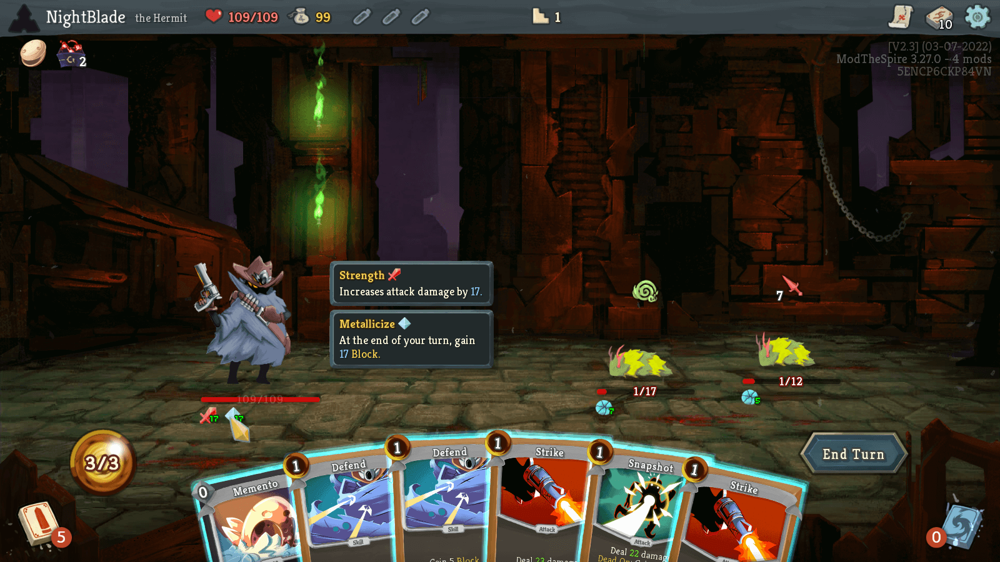

# Slay The Spire: Persistent Upgrades Mod

Slay the Spire too hard? Looking for something to get out of each run? Now you can! With this mod, after every failed run, you get:

- An additional +2 max HP
- Additional +1 strength
- +1 metallicize

These compound over time, so 10 failed runs see you starting with +20 max HP, 10 strength, and 10 metallicize.

# Installation Instructions

[Download from Steam Workshop](https://steamcommunity.com/sharedfiles/filedetails/?id=2814839314).

# Development Setup

These instructions are for Steam; follow appropriate download instructions for other platforms.

- If this is your first mod, subscribe to (Steam workshop) or download the "Mod the Spire" mod
- If you don't have it downloaded, subscribe to or download the "BaseMod" mod
- Create the `<slay the spire directory>/mods` directory if it doesn't exist
- Copy the JAR file for this mod over into `mods`
- Run the game with mods enabled

